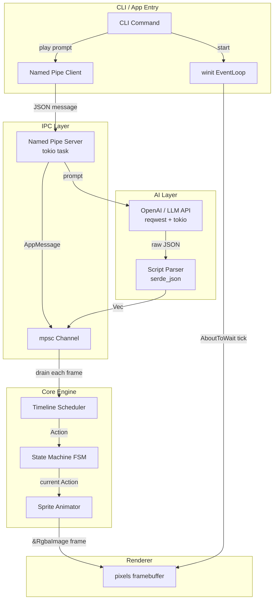

# AI Desktop Pet Theatre: Technical Design

## 一、系统架构 (System Architecture)

本项目采用**核心引擎分离**与**CLI 驱动**的架构设计。



---

## 二、技术选型 (Technology Decisions)

所有依赖均已确定，不存在备选项。

| 职责 | Crate | 版本 |
|---|---|---|
| 窗口宿主 | `winit` | 0.30 |
| 帧缓冲渲染 | `pixels` | 0.14 |
| PNG 解码 | `image` | 0.25 |
| 异步运行时 | `tokio` (multi-thread) | 1 |
| HTTP 客户端 | `reqwest` (rustls-tls) | 0.12 |
| CLI 解析 | `clap` (derive) | 4 |
| JSON 序列化 | `serde` + `serde_json` | 1 |
| 日志 | `tracing` + `tracing-subscriber` | 0.1 |
| 底层错误 | `thiserror` | 2 |
| 应用层错误 | `anyhow` | 1 |

---

## 三、核心模块设计

### 1. Cargo Workspace 结构

```
ai-pet/
├── Cargo.toml              # Workspace 根，统一依赖版本
├── rust-toolchain.toml     # 锁定工具链版本
├── core_engine/            # 纯逻辑 Crate，无 I/O、无网络、无窗口依赖
│   └── src/
│       ├── lib.rs
│       ├── animation/      # Sprite 帧播放（时间驱动）
│       ├── state_machine/  # FSM 状态流转
│       ├── timeline/       # 事件调度器
│       └── scripting/      # 共享数据类型：Action、TimelineEvent
└── cli_app/                # 组装层 Crate，负责 I/O、网络、窗口
    └── src/
        ├── main.rs         # Clap CLI 入口（subcommands: start / play / stop）
        ├── ai/             # LlmClient trait + OpenAI 实现
        ├── ipc/            # Windows Named Pipe 服务端与客户端
        └── window/         # winit 事件循环 + pixels 渲染器

assets/
├── sprites/
│   ├── idle/    001.png 002.png …
│   ├── walk/    001.png …
│   ├── jump/    001.png …
│   ├── attack/  001.png …
│   ├── sleep/   001.png …
│   ├── happy/   001.png …
│   └── angry/   001.png …
└── config/
    └── pet_config.json
```

### 2. Animation Engine（动画引擎）

**类型定义：**

```rust
// Texture 即解码后的 RGBA 像素数据，启动时全量加载，Arc 共享避免重复克隆
type Texture = Arc<image::RgbaImage>;
```

**核心结构：**

```rust
pub struct Animation {
    pub frames: Vec<Texture>,
    pub frame_duration: std::time::Duration,
    pub looped: bool,
}

pub struct Animator {
    animations: HashMap<Action, Animation>,
    current_action: Action,
    elapsed: std::time::Duration,
}

impl Animator {
    /// delta 由 winit 主循环通过 Instant 差值计算，类型为 Duration 避免浮点累积误差
    pub fn update(&mut self, delta: std::time::Duration) -> &Texture {
        self.elapsed += delta;
        let anim = &self.animations[&self.current_action];
        let frame_idx = (self.elapsed.as_millis()
            / anim.frame_duration.as_millis())
            as usize;
        let idx = if anim.looped {
            frame_idx % anim.frames.len()
        } else {
            frame_idx.min(anim.frames.len() - 1)
        };
        &anim.frames[idx]
    }

    pub fn set_action(&mut self, action: Action) {
        if self.current_action != action {
            self.current_action = action;
            self.elapsed = std::time::Duration::ZERO;
        }
    }
}
```

**资产加载：** PNG 文件在启动时通过 `image::open()` 全量解码为 `RgbaImage`，并用 `Arc` 包装。加载失败返回 `EngineError::AssetNotFound(path)`，不 panic。

### 3. State Machine（状态机）

```rust
pub enum PetState {
    Idle,     // 默认待机，循环播放 idle 动画
    Acting,   // 已接收到 play 指令，等待 LLM 响应
    Scripted, // 正在按时间轴播放 AI 剧本
}
```

**状态转移表（完整）：**

| 当前状态 | 触发事件 | 目标状态 |
|---|---|---|
| `Idle` | `AppMessage::InjectTimeline` | `Scripted` |
| `Idle` | `InputEvent::Click` | `Acting` |
| `Acting` | `AppMessage::InjectTimeline` | `Scripted` |
| `Acting` | `AppMessage::LlmError` | `Idle` |
| `Scripted` | `TimelineEvent::Finished` | `Idle` |
| 任意 | `InputEvent::Drag` | 不变（在当前状态内处理位移） |

> `Acting` 是"等待 LLM 中"的状态，不是"正在表演"的状态。`Scripted` 才是表演态。

### 4. Timeline Scheduler（时间轴调度器）

```rust
pub struct TimelineEvent {
    pub timestamp_ms: u64,  // 相对剧本开始时间的毫秒偏移量（整数，避免浮点比较）
    pub actor_id: String,
    pub action: Action,
}

pub struct Timeline {
    /// 始终保持按 timestamp_ms 升序排列，push_events 时自动排序
    events: Vec<TimelineEvent>,
    elapsed_ms: u64,
    finished: bool,
}

impl Timeline {
    pub fn push_events(&mut self, mut events: Vec<TimelineEvent>) {
        events.sort_by_key(|e| e.timestamp_ms);
        self.events = events;
        self.elapsed_ms = 0;
        self.finished = false;
    }

    /// 返回本 tick 内到期的所有事件
    pub fn tick(&mut self, delta: std::time::Duration) -> Vec<&TimelineEvent> {
        // ...
    }
}
```

### 5. AI Script Parser（LLM 剧本编译器）

**LLM System Prompt Template（固定不变）：**

```
You are a desktop pet choreographer. Given a user instruction, output ONLY a valid JSON object. No explanation, no markdown, no code fences.

Rules:
- "characters" must be ["pet1"]
- "events" is an array where each item has:
    "timestamp_ms": integer >= 0
    "actor_id": string (must be "pet1")
    "action": one of: idle, walk, jump, attack, sleep, happy, angry
- Total duration must not exceed 10000 ms
- Minimum 2 events, maximum 20 events
- Events may be in any order; the engine sorts them

Output schema (exactly):
{"characters":["pet1"],"events":[{"timestamp_ms":0,"actor_id":"pet1","action":"idle"}]}
```

**期望 JSON 格式：**

```json
{
  "characters": ["pet1"],
  "events": [
    { "timestamp_ms": 0,    "actor_id": "pet1", "action": "angry" },
    { "timestamp_ms": 1000, "actor_id": "pet1", "action": "attack" },
    { "timestamp_ms": 3000, "actor_id": "pet1", "action": "idle" }
  ]
}
```

**白名单验证：** `action` 字段通过枚举转换实现白名单过滤。白名单外的字符串 fallback 为 `Action::Idle`，记录 `tracing::warn!`，不返回错误。LLM 响应非合法 JSON 时，返回 `Err` 并保持 `Idle` 状态。

---

## 四、线程模型与游戏循环 (Thread Model & Game Loop)

```
┌─────────────────────────────────────────────────────┐
│  Main Thread (winit EventLoop — Windows 强制要求)    │
│  ┌──────────────────────────────────────────────┐   │
│  │  Event::AboutToWait (每帧 tick)              │   │
│  │  1. drain mpsc::Receiver<AppMessage>         │   │
│  │  2. timeline.tick(delta)                     │   │
│  │  3. state_machine.apply(events)              │   │
│  │  4. animator.update(delta) -> &RgbaImage     │   │
│  │  5. pixels.render() — blit to framebuffer    │   │
│  └──────────────────────────────────────────────┘   │
└─────────────────────────────────────────────────────┘
         ↑ mpsc::Sender<AppMessage>
┌─────────────────────────────────────────────────────┐
│  Tokio Runtime (multi-thread，主线程启动后 spawn)    │
│  ├── Task: Named Pipe Server (IPC 监听)             │
│  │     收到 prompt → spawn LLM Task               │
│  └── Task: LLM HTTP call (reqwest)                 │
│         成功 → parse JSON → send AppMessage         │
│         失败 → send AppMessage::LlmError            │
└─────────────────────────────────────────────────────┘
```

**关键规则：**
- Windows 要求创建窗口的线程拥有 `EventLoop::run`，主线程不可阻塞。
- 跨线程通信使用 `std::sync::mpsc`（Sender 给 Tokio，Receiver 在主线程帧循环中 drain）。
- winit 使用 `ControlFlow::Poll`（非 `Wait`），保证每帧都执行 `AboutToWait`。
- Delta time 通过 `Instant::now()` 与上帧时间戳做差获得，类型为 `Duration`。

**`AppMessage` 类型：**

```rust
pub enum AppMessage {
    InjectTimeline(Vec<TimelineEvent>),
    LlmError(String),
    Shutdown,
}
```

---

## 五、IPC 机制 (Windows Named Pipes)

目标平台为 Windows，IPC 使用 **Windows Named Pipes**（`tokio::net::windows::named_pipe`）。

- **Pipe 名称：** `\\.\pipe\ai-pet-ipc`
- **服务端：** `ai-pet start` 启动时，在 Tokio runtime 中 spawn 一个循环 accept 的 Task。
- **客户端：** `ai-pet play` 作为纯客户端，连接后写入消息，完成后退出。

**消息格式（wire format）：**

```
[4 bytes: u32 LE — body length] [N bytes: UTF-8 JSON body]
```

```json
{ "prompt": "让宠物打一个喷嚏然后睡觉" }
```

平台限制说明：Named Pipe 代码放在 `cli_app/src/ipc/` 中，全部使用 `#[cfg(target_os = "windows")]` 守卫。非 Windows 平台（如开发者使用 macOS）提供 `#[cfg(not(target_os = "windows"))]` stub，返回 `Err("IPC only supported on Windows")`，确保 crate 可编译但不可运行。

---

## 六、Windows 平台渲染说明 (Renderer Platform Notes)

| 能力 | 实现方式 |
|---|---|
| 无边框窗口 | `WindowAttributes::with_decorations(false)` |
| 背景透明 | `WindowAttributes::with_transparent(true)` + pixels 中 alpha=0 的像素完全透明 |
| 永远置顶 | `WindowAttributes::with_window_level(WindowLevel::AlwaysOnTop)` |
| 可拖拽 | 监听 `WindowEvent::CursorMoved`，记录鼠标偏移量，调用 `window.set_outer_position()` |
| 点击穿透 | **MVP 范围外**，需调用 Win32 `SetWindowLong(WS_EX_LAYERED \| WS_EX_TRANSPARENT)`，预留为 Post-MVP |
